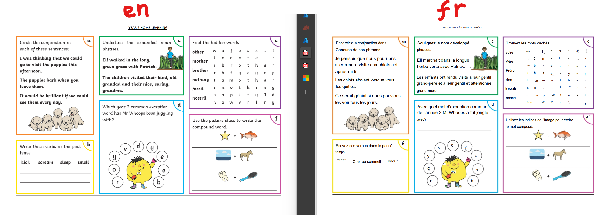

# Sitecore Hackathon 2024

- MUST READ: **[Submission requirements](SUBMISSION_REQUIREMENTS.md)**
- [Entry form template](ENTRYFORM.md)
  
## Team name
Team Horizon 2024

## Category
1. Best use of AI

# Our Solution Summary

This is an attempt to design a solution that leverages [Azure AI Translator](https://learn.microsoft.com/en-us/azure/ai-services/translator/translator-overview) service to automate document transcreations to different languages. The idea is to integrate XM Cloud with Batch document translations service, where by documents are pushed from Media Library in bulk into [Azure Blob storage](https://azure.microsoft.com/en-us/products/storage/blobs/). They are then translated in bulk and are stored in a staged location within Azure Blob storage. The XM Cloud can then pull those back into Media Libary, for delivery to a global audience. 

The vision is to enable businesses to take advantage of advances in AI natural language processing, and reduce costs and time it takes to transcreate business critical documents such as marketing material for their markets. Since Azure AI can translate documents whilst preserving their formats, this for me is the 'best use of AI' with XM Cloud to meet business needs.

I realised this was a huge undertaking, with one team member. However, I have started building the various componets to deliver the vision. This includes:
- An Azure AI Services Func app microservice (which islocated within the `DocuTranslator` subfolder)
- An SPE orechestration module built on XM Cloud to push documents from the Media Library to Azure Blob Storage for transcreation. Then pull the output and push it back into Media Library. 
- An UX enhancement to XM Cloud Ribbon or Workflow enhancement to enable business users to incorporate this content automation in their processes
- I am planning to finalise the last two parts post the Hackathon due to timing constraints.

## Sample transcreation output

Below is a sample pdf image that has been transcreated with this service. The document structure is preserved, but not sure about the font.




## Video link
⟹ Sorry no video this time round


## Pre-requisites and Dependencies

⟹ Does your module rely on other Sitecore modules or frameworks?

- Azure AI Services Func app microservice, further details below


## Installation instructions
To run locally, refer to  'Development' section.
Then Use the Sitecore CLI to serialize items into local environemnt

 ```ps1
1. dotnet sitecore cloud login
2. dotnet sitecore connect --ref xmcloud --cm  https://xmcloudcm.localhost --allow-write true -n default
3. dotnet sitecore ser pull -n "default"
```


### Configuration
The Azure Func all solution requires the following settings to run locally. A sample [`local.settings.json`](src/DocuTranslator/TeamHorizon.DocuTranslator/local%20.settings-sample.json) has been included for reference
 ```ps1
1. "docu_translation_endpoint": "Azure AI services document translation endpoint, more details in Usage instructions below"
2. "azure_key": "Azure AI services document translation key"
3. "docu_source_uri": "The URL for the source container containing documents to be translated"
4. "docu_target_uri": "The URL for the target container to which the translated documents are written"
5. "docu_target_lang": "The language code for the translated documents, e.g., fr for French"
6. "funcapp_api_key":"Your custom function app API key"
 ```

## Usage instructions
⟹ Provide documentation about your module, how do the users use your module, where are things located, what do the icons mean, are there any secret shortcuts etc.

To invoke the Func app locally, create POST request using a tool like Postman, as shown below. Use `X-Api-Key` to pass API key on the header


Document Translation is only supported in the S1 Standard Service Plan (Pay-as-you-go) or in the D3 Volume Discount Plan. This service needs to be provisioned on Azure Portal
[Azure AI Translator](https://azure.microsoft.com/en-us/pricing/details/cognitive-services/translator)

## XM Cloud Local setup
⟹ [Adopted from XM Cloud Starter Kit (Next JS)](https://github.com/sitecorelabs/xmcloud-foundation-head-staging)


1. In an ADMIN terminal:

    ```ps1
    .\init.ps1 -InitEnv -LicenseXmlPath "C:\path\to\license.xml" -AdminPassword "DesiredAdminPassword"
    ```

2. Restart your terminal and run:

    ```ps1
    .\up.ps1
    ```
